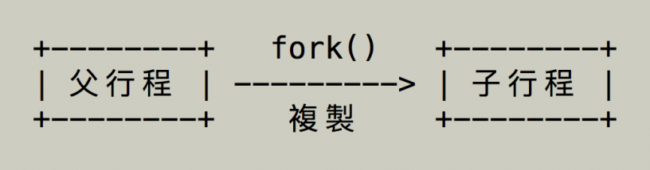
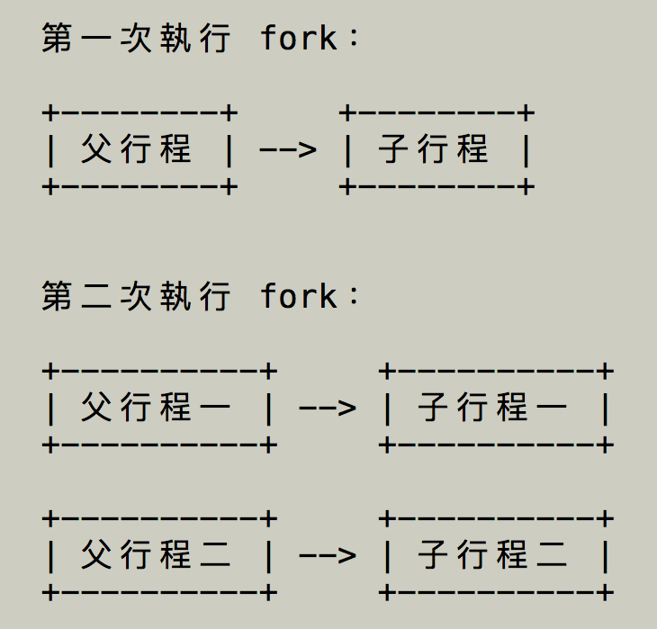

_Cloned from https://blog.gtwang.org/programming/c-fork-tutorial-multi-process-programming/_

這裡介紹如何使用 C 語言的 `fork` 函數建立子行程，設計多行程的平行化程式。

C 語言中的 `fork` 函數可以將目前的程式行程（process）複製一份，建立出新的子行程（child process），而原本的行程就稱為父行程（parent process）。



`fork` 在執行之後，會傳回一個整數的傳回值，以下是各種數值所代表的意義：
* 負值（小於零）：建立子行程失敗。
* 零：代表這個程式處於新建立的子行程中。
* 正值（大於零）：代表這個程式處於原本的父行程中，這個整數值則是子行程的 ID。

在程式設計上我們可以靠著 `fork` 的傳回值來判別父行程與子行程，進而讓不同的行程處理不同的工作。新建立的子行程會有獨立的行程 ID（process ID），與父行程的行程 ID 不同。
> `fork` 函數只有在 Linux 系統上可以使用，在一般的 Windows 開發環境中無法使用這種方式建立行程，若要在 Windows 中使用，請參考 Cygwin 等環境。

# Hello World
以下是最簡單的 hello world 範例程式碼，程式在呼叫 `fork` 建立新的行程之後，讓父行程與子行程兩個行程都輸出一樣的文字訊息
```c
// fork1.c
#include <stdio.h>
#include <unistd.h>
int main() {
  // 建立子行程
  fork();

  // 從這裡開始變成兩個行程

  // 兩個行程執行同樣的程式
  printf("Hello world!\n");

  return 0;
}
```
使用 `gcc` 編譯後，直接執行：
```sh
gcc -o fork1 fork1.c
./fork1
```
> Hello world! <br>
> Hello world! <br>

# 重複建立子行程
由於每次呼叫 `fork` 時，就會讓程式行程的數量變成原來的兩倍，所以如果重複呼叫 `fork` 的話，形成數量就會以指數的速度增長。
```c
// fork2.c
#include <stdio.h>
#include <unistd.h>
int main() {
  // 建立子行程
  fork();

  // 建立子行程的子行程
  fork();

  // 所有行程都輸出一樣的訊息
  printf("Hello world!\n");

  return 0;
}
```
編譯與執行：
```sh
gcc -o fork2 fork2.c
./fork2
```
> Hello world! <br>
> Hello world! <br>
> Hello world! <br>
> Hello world! <br>

執行兩次 `fork` 之後，就會產生四個程式行程：



# 區分父行程與子行程
這個範例是示範使用 `fork` 的傳回值來判斷父行程與子行程，讓兩個行程分別執行不同的程式碼：
```c
// fork3.c
#include <stdio.h>
#include <unistd.h>
int main() {
  pid_t pid;

  // 建立子行程
  pid = fork();

  if (pid == 0) {
    // 子行程
    printf("Child process!\n");
  } else if (pid > 0) {
    // 父行程
    printf("Parent process!\n");
  } else {
    // 錯誤
    printf("Error!\n");
  }

  return 0;
}
```
編譯與執行：
```sh
gcc -o fork3 fork3.c
./fork3
```
由於我們無法預測作業系統會先執行哪一個行程，所以這個程式的輸出有可能是
> Parent process! <br>
> Child process!

或是
> Child process! <br>
> Parent process!

# 多行程程式的變數與資料
不同行程之間的變數與資料都是互相獨立的，所以在其中一個行程中更改變數中的資料，並不會影響另外一個行程：
```c
// fork4.c
#include <stdio.h>
#include <unistd.h>
int main() {
  pid_t pid;

  // 建立一個變數
  int x = 1;

  pid = fork();

  if (pid == 0) {
    // 子行程的變數
    printf("Child has x = %d\n", ++x);
  } else if (pid > 0) {
    // 父行程的變數
    printf("Parent has x = %d\n", --x);
  } else {
    printf("Error!\n");
  }

  return 0;
}
```
雖然這裡的 `x` 是一個全域變數（global variable），但是兩個行程互相獨立，所以不會互相影響。

編譯與執行：
```sh
gcc -o fork4 fork4.c
./fork4
```
>Parent has x = 0 <br>
> Child has x = 2